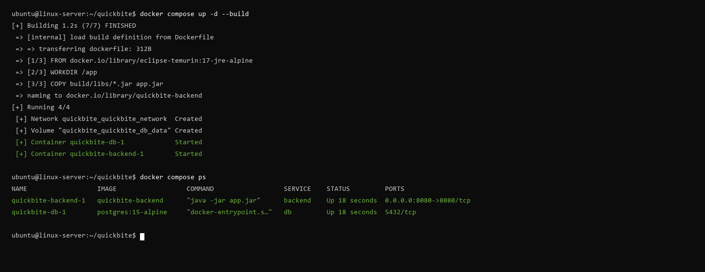
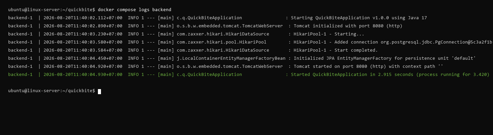
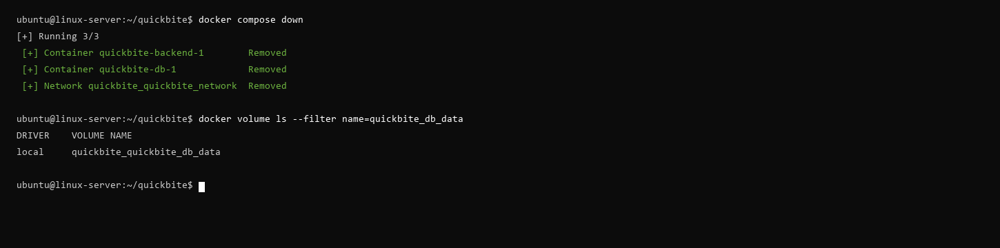

# Báo Cáo Thực Hành Tổng Hợp - Session 04

## 1. Mục Tiêu Thực Hành

- Đóng gói hoàn chỉnh ứng dụng **Java Spring Boot** thành Docker Image tối ưu với multi-stage / JRE Alpine.
- Thiết kế tệp điều phối **`docker-compose.yml`** cho cụm dịch vụ đa container (*Multi-container System*).
- Quản lý toàn diện biến môi trường (*Environment*), cơ chế lưu trữ dữ liệu bền vững (*Named Volume*), và mạng ảo nội bộ (*Custom Bridge Network*).
- Vận hành vòng đời hệ thống bằng các câu lệnh Docker Compose chuẩn DevOps (Build, Up, Logs, Down).

---

## 2. Chi Tiết Thực Hiện Các Nhiệm Vụ

### 2.1. Nhiệm vụ 1: Đóng gói ứng dụng Backend bằng Dockerfile

- **Thực hiện biên dịch mã nguồn Java:**

  ```bash
  ./gradlew clean bootJar
  ```

  Tệp `.jar` được sinh ra tại thư mục `build/libs/`.

- **Cấu hình `Dockerfile`:**
  - Sử dụng base image tối ưu dung lượng: `eclipse-temurin:17-jre-alpine`.
  - Thiết lập thư mục làm việc `/app`.
  - Sao chép file `.jar` và định nghĩa entrypoint thực thi.

```dockerfile
# Base image tối ưu dung lượng cho môi trường chạy Java 17
FROM eclipse-temurin:17-jre-alpine

# Thiết lập thư mục làm việc mặc định trong container
WORKDIR /app

# Sao chép file .jar đã được biên dịch từ Gradle vào container
COPY build/libs/*.jar app.jar

# Khai báo lệnh thực thi khi container khởi động
ENTRYPOINT ["java", "-jar", "app.jar"]
```

---

### 2.2. Nhiệm vụ 2: Thiết lập hệ thống đa dịch vụ với Docker Compose

Tạo tệp `docker-compose.yml` với 2 services chính:
1. **Service `db` (PostgreSQL 15 Alpine):**
   - Không mở cổng ra máy host để đảm bảo an ninh.
   - Gắn Named Volume `quickbite_db_data:/var/lib/postgresql/data` để duy trì dữ liệu bền vững.
2. **Service `backend` (Spring Boot):**
   - Tự động build từ `Dockerfile` (`build: .`).
   - Mở cổng `8080:8080` ra ngoài máy host.
   - Kết nối cơ sở dữ liệu qua hostname nội bộ `db` (`SPRING_DATASOURCE_URL=jdbc:postgresql://db:5432/quickbite_db`).
3. **Mạng nội bộ:** Cả hai service cùng kết nối vào custom network `quickbite_network` (driver `bridge`).

```yaml
version: '3.8'

services:
  db:
    image: postgres:15-alpine
    environment:
      - POSTGRES_USER=postgres
      - POSTGRES_PASSWORD=secret
      - POSTGRES_DB=quickbite_db
    volumes:
      - quickbite_db_data:/var/lib/postgresql/data
    networks:
      - quickbite_network

  backend:
    build: .
    ports:
      - "8080:8080"
    environment:
      - SPRING_DATASOURCE_URL=jdbc:postgresql://db:5432/quickbite_db
      - SPRING_DATASOURCE_USERNAME=postgres
      - SPRING_DATASOURCE_PASSWORD=secret
    depends_on:
      - db
    networks:
      - quickbite_network

volumes:
  quickbite_db_data:

networks:
  quickbite_network:
    driver: bridge
```

---

### 2.3. Nhiệm vụ 3: Khởi chạy và Giám sát hệ thống

- **Lệnh thực thi:**

  ```bash
  docker compose up -d --build
  docker compose ps
  ```

- **Minh chứng trạng thái Container (Ảnh 1):**



- **Lệnh kiểm tra log kết nối Backend:**

  ```bash
  docker compose logs backend
  ```

- **Minh chứng Log Backend & Kết Nối Database Thành Công (Ảnh 2):**



---

### 2.4. Nhiệm vụ 4: Kiểm thử dọn dẹp hệ thống

- **Lệnh dọn dẹp:**

  ```bash
  docker compose down
  docker volume ls --filter name=quickbite_db_data
  ```

- **Minh chứng dọn dẹp an toàn và bảo toàn dữ liệu (Ảnh 3):**



---

## 3. Danh Mục Tệp Nộp Bài

1. **Báo cáo thực hành:** [`report_session04.md`](./report_session04.md)
2. **File đóng gói Docker:** [`Dockerfile`](./Dockerfile)
3. **File điều phối Compose:** [`docker-compose.yml`](./docker-compose.yml)
4. **Ảnh minh chứng:**
   - [`task3_docker_compose_ps.png`](./task3_docker_compose_ps.png)
   - [`task3_docker_compose_logs.png`](./task3_docker_compose_logs.png)
   - [`task4_docker_compose_down.png`](./task4_docker_compose_down.png)
